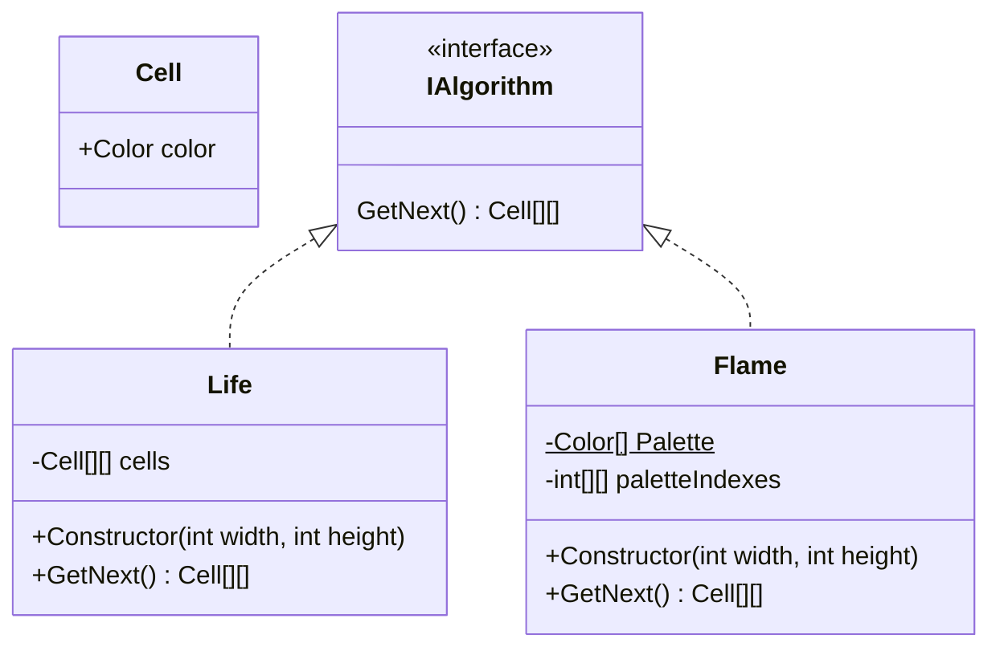
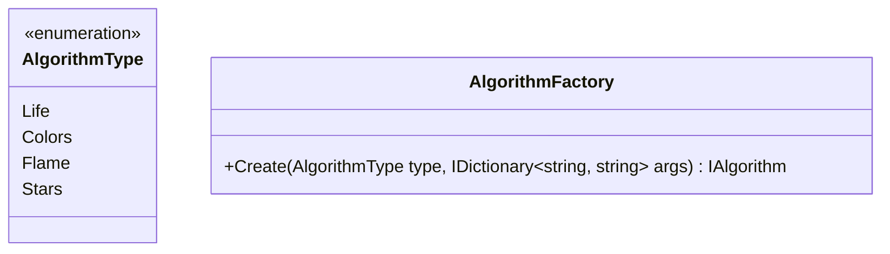
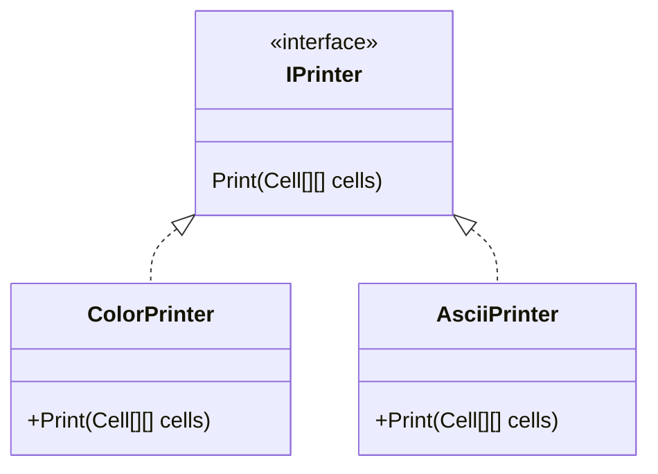
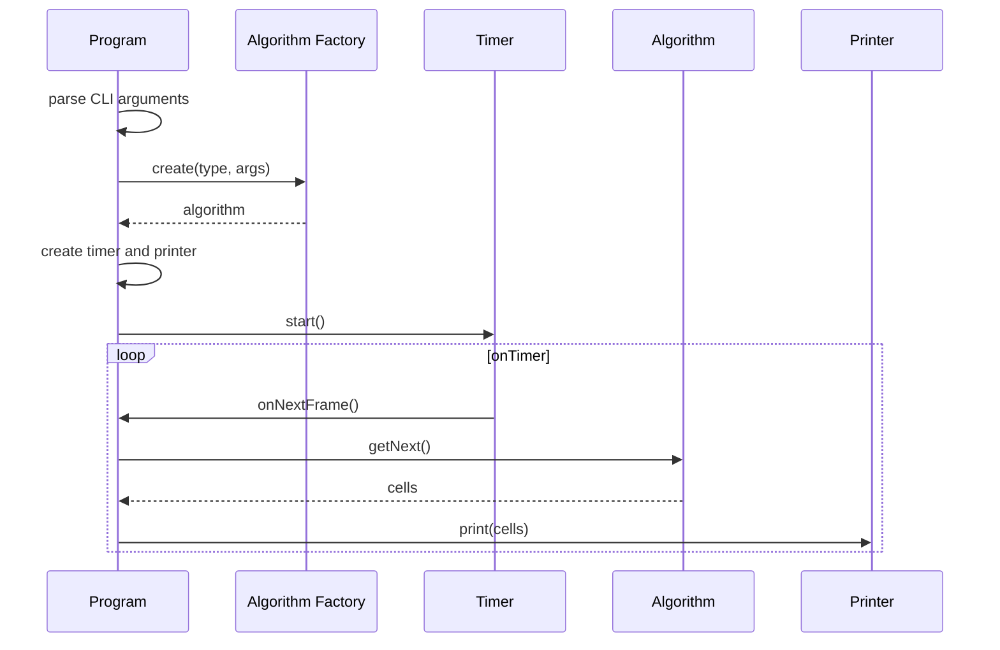
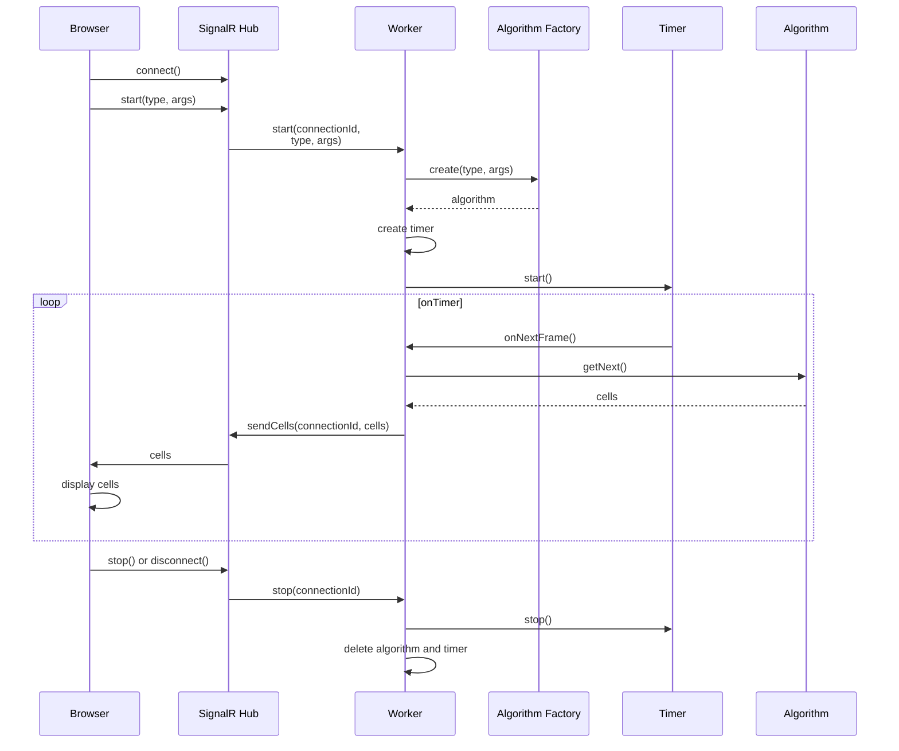

# Patterns

## Description

The program displays grid of color cells which changes over time according to some rules. Example of such rules is [life game](https://en.m.wikipedia.org/wiki/Conway%27s_Game_of_Life).
Application has shared core and several UI's.
Example of console version displayed using ASCII printer:
```
.x..x.
..xx..
.x.x.x
xx.x..
.x....
xxx.xx
```

## How to Build

To build frontend for Patterns.Web:
```bash
npm i
npm run build
```

To build backend for Patterns.Web or Patterns.Console:
```bash
dotnet build
```

## Diagrams

### Core





### Console Application





### Web Application with SignalR


